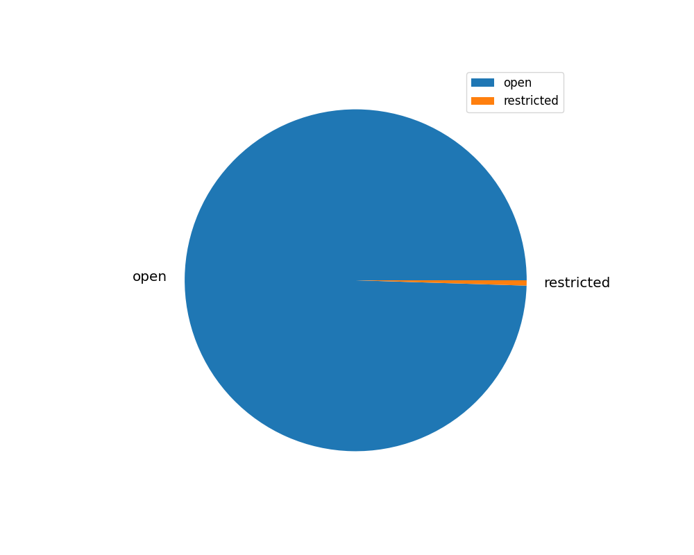
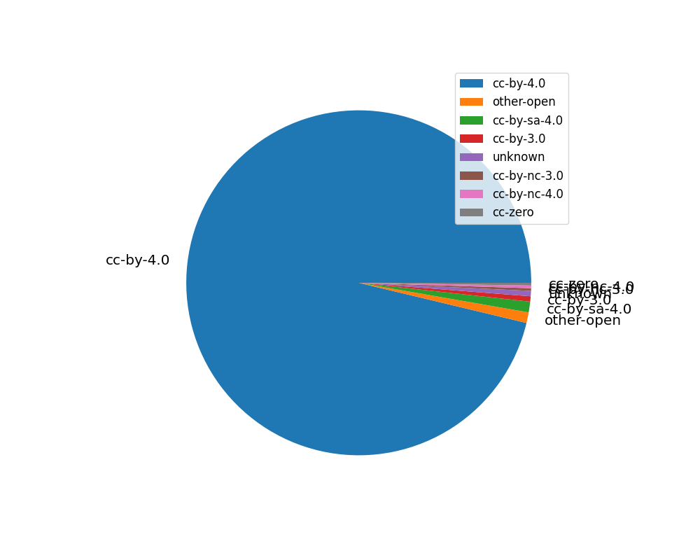
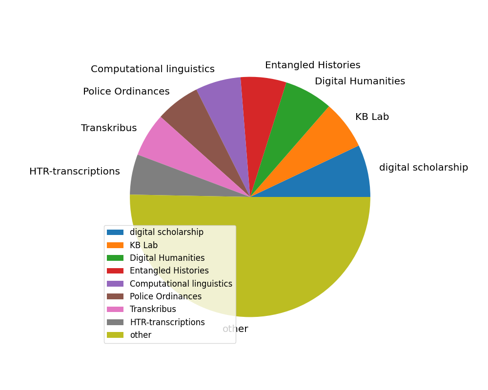
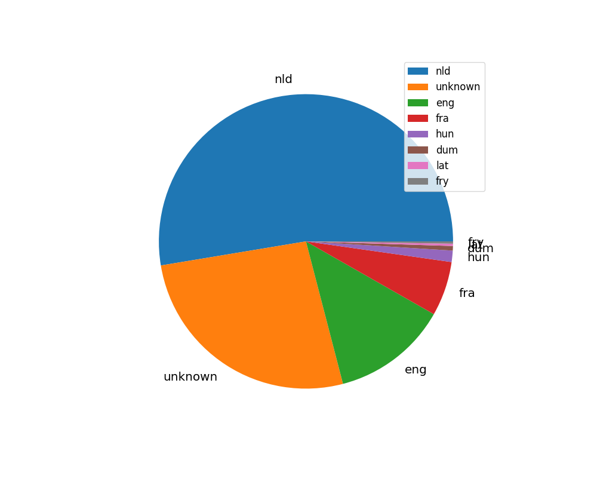
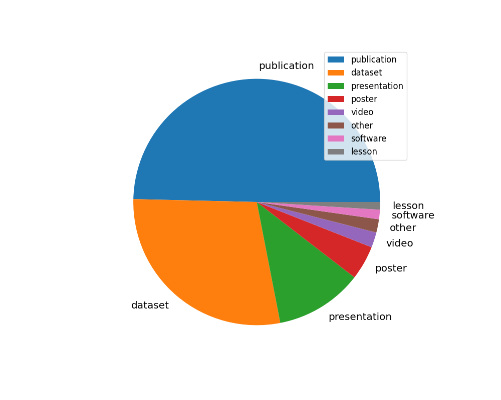
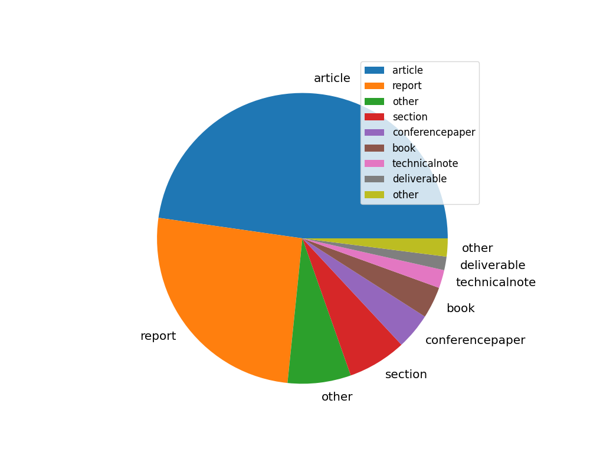
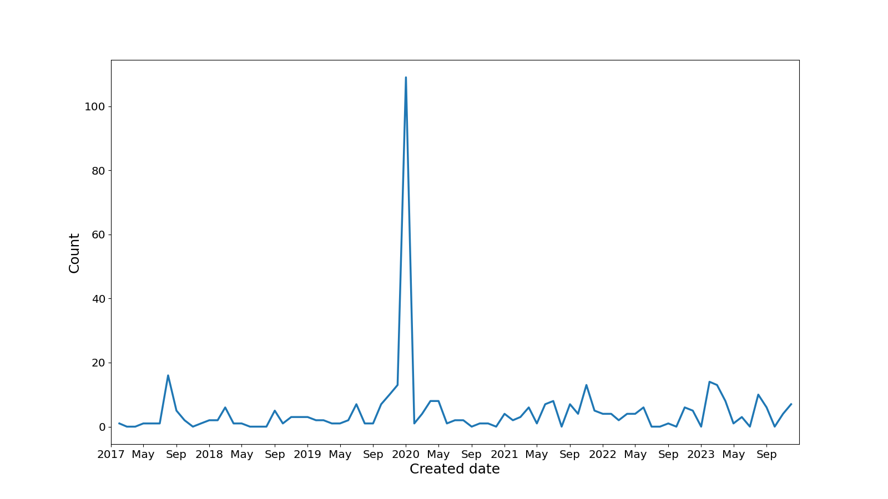
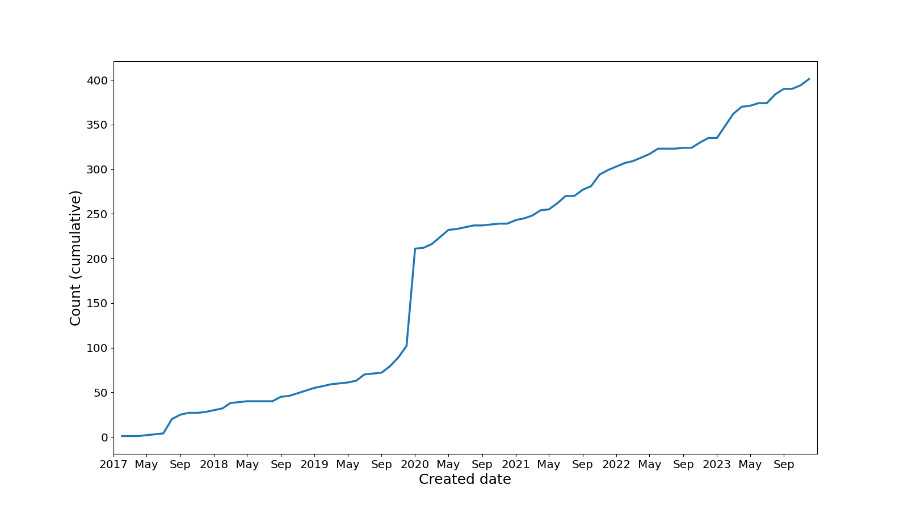
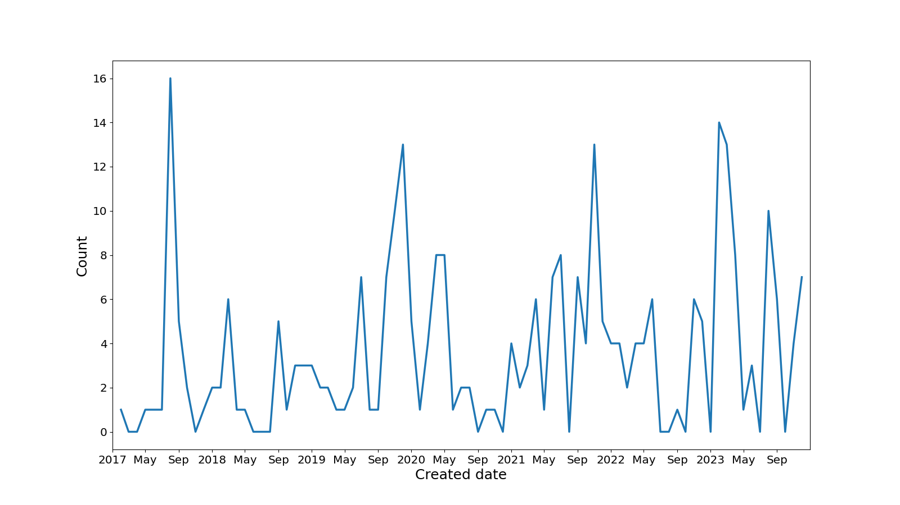
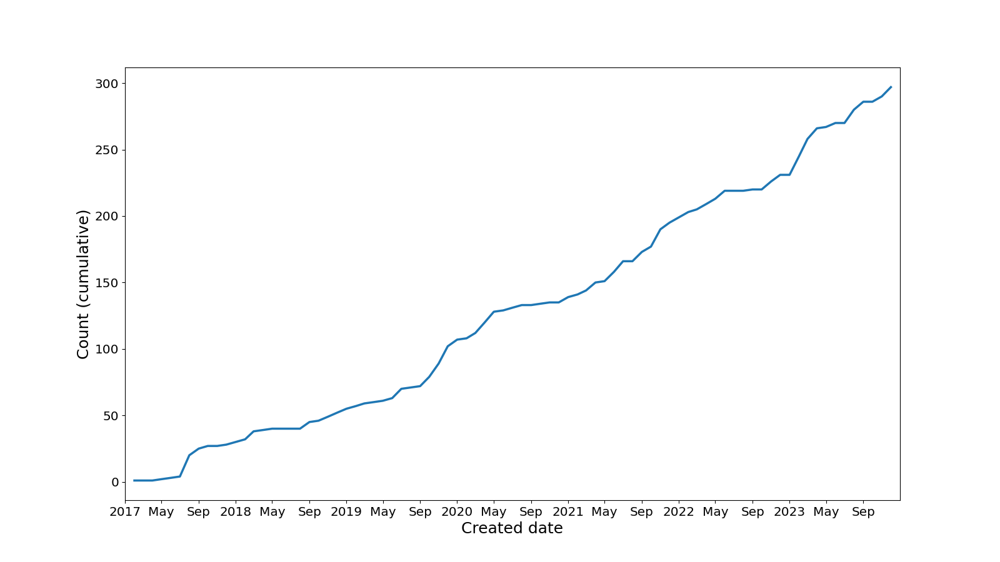

# Zenodo community report

Created: 2024-01-29 14:38:06.503883

Input file: /home/johan/kb/zenodo/databases/kbnl-2024-01-01.json

## Access rights

| accessRight   |   Count |
|:--------------|--------:|
| open          |     399 |
| restricted    |       2 |

[Download data as CSV](./csv/access-rights.csv)

## Licenses

| license      |   Count |
|:-------------|--------:|
| cc-by-4.0    |     386 |
| other-open   |       4 |
| cc-by-sa-4.0 |       4 |
| cc-by-3.0    |       2 |
| unknown      |       2 |
| cc-by-nc-3.0 |       1 |
| cc-by-nc-4.0 |       1 |
| cc-zero      |       1 |

[Download data as CSV](./csv/licenses.csv)

## Keywords

| keyword                   |   Count |
|:--------------------------|--------:|
| digital scholarship       |     135 |
| KB Lab                    |     126 |
| Digital Humanities        |     125 |
| Entangled Histories       |     118 |
| Computational linguistics |     117 |
| Police Ordinances         |     115 |
| Transkribus               |     113 |
| HTR-transcriptions        |     104 |
| other                     |     965 |

[Download data as CSV](./csv/keywords.csv)

## Languages

| language   |   Count |
|:-----------|--------:|
| nld        |     211 |
| unknown    |     106 |
| eng        |      51 |
| fra        |      24 |
| hun        |       5 |
| dum        |       2 |
| lat        |       1 |
| fry        |       1 |

[Download data as CSV](./csv/languages.csv)

## Publication types

| type         |   Count |
|:-------------|--------:|
| publication  |     199 |
| dataset      |     114 |
| presentation |      46 |
| poster       |      18 |
| video        |       8 |
| other        |       7 |
| software     |       5 |
| lesson       |       4 |

[Download data as CSV](./csv/pub-types.csv)

## Publication subtypes

| subtype         |   Count |
|:----------------|--------:|
| article         |      95 |
| report          |      51 |
| other           |      14 |
| section         |      13 |
| conferencepaper |       8 |
| book            |       7 |
| technicalnote   |       4 |
| deliverable     |       3 |
| other           |       4 |

[Download data as CSV](./csv/pub-subtypes.csv)

## Created dates

[Download data as CSV](./csv/created.csv)

## Created dates (excluding EH transcriptions)

[Download data as CSV](./csv/created-noeh.csv)

