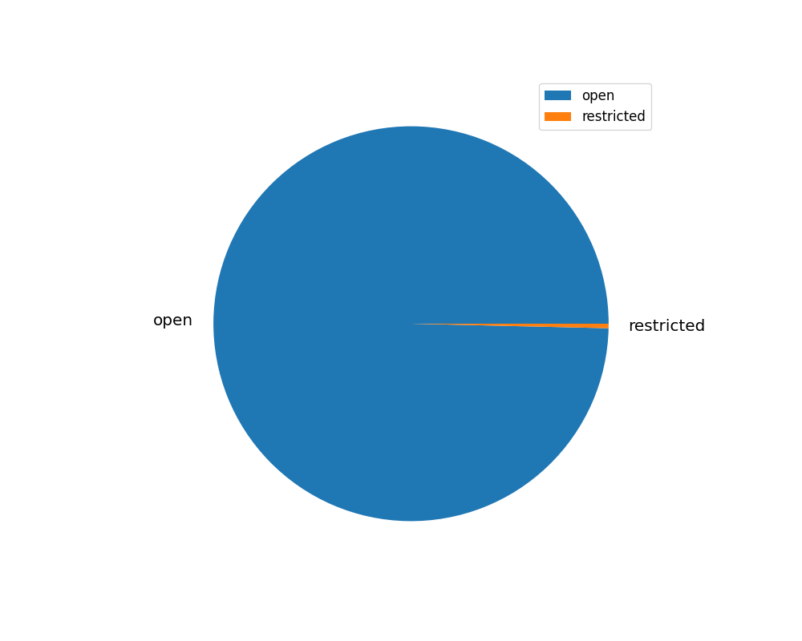
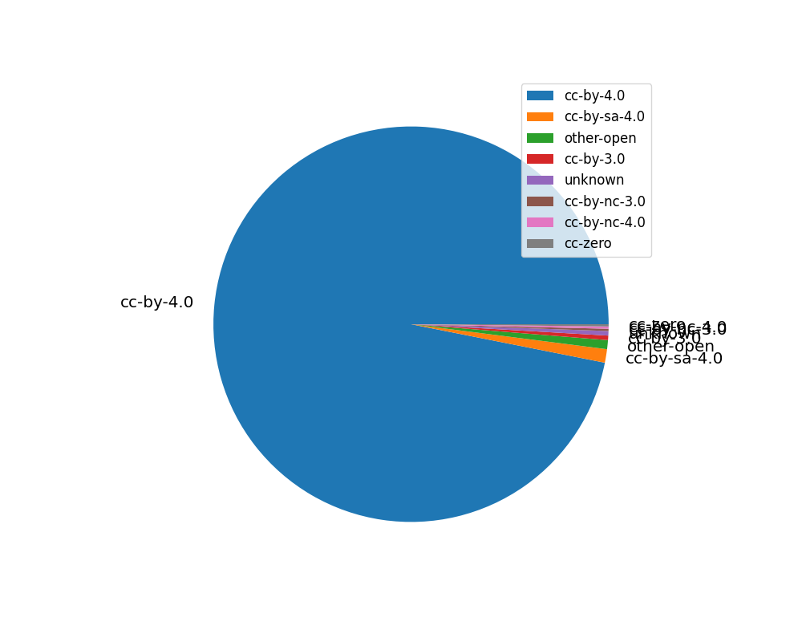
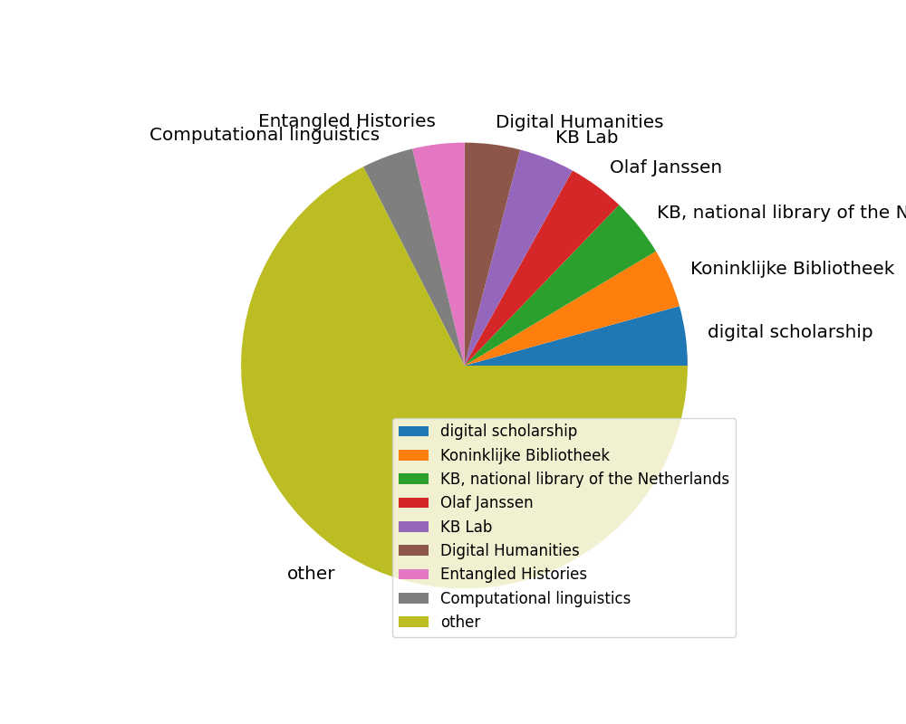
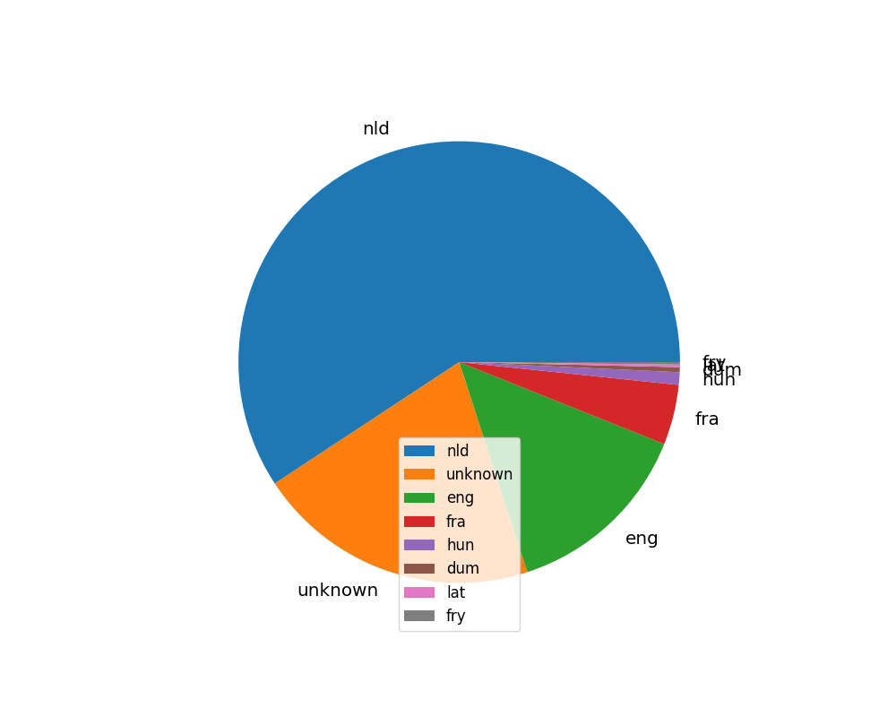
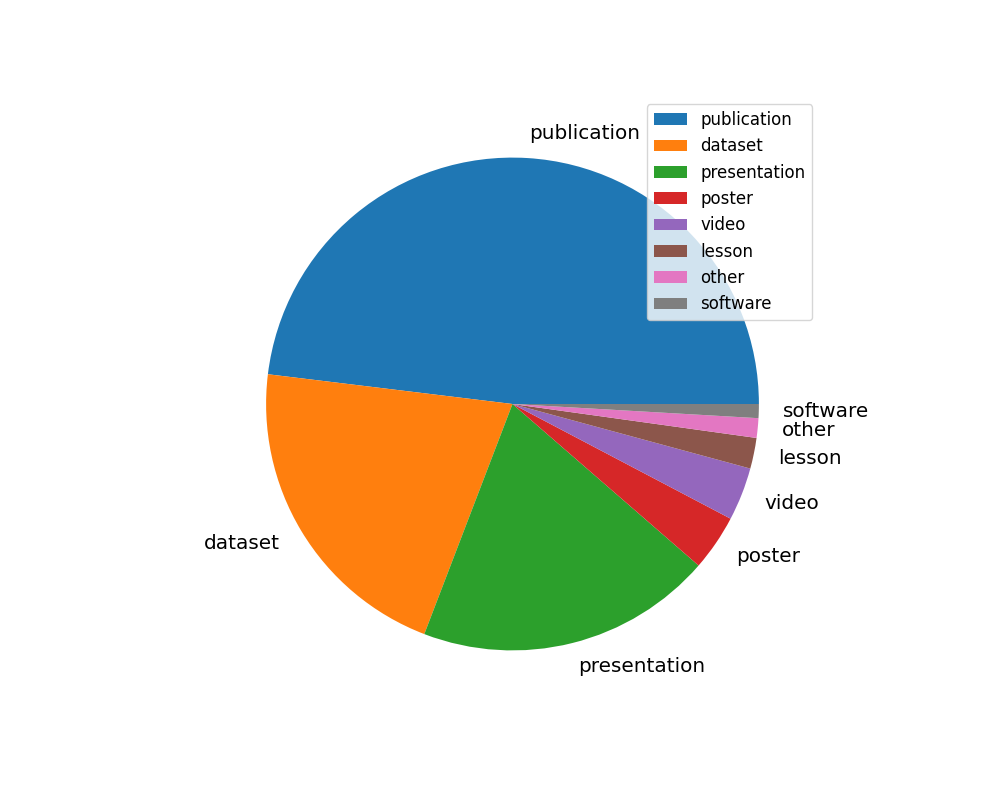
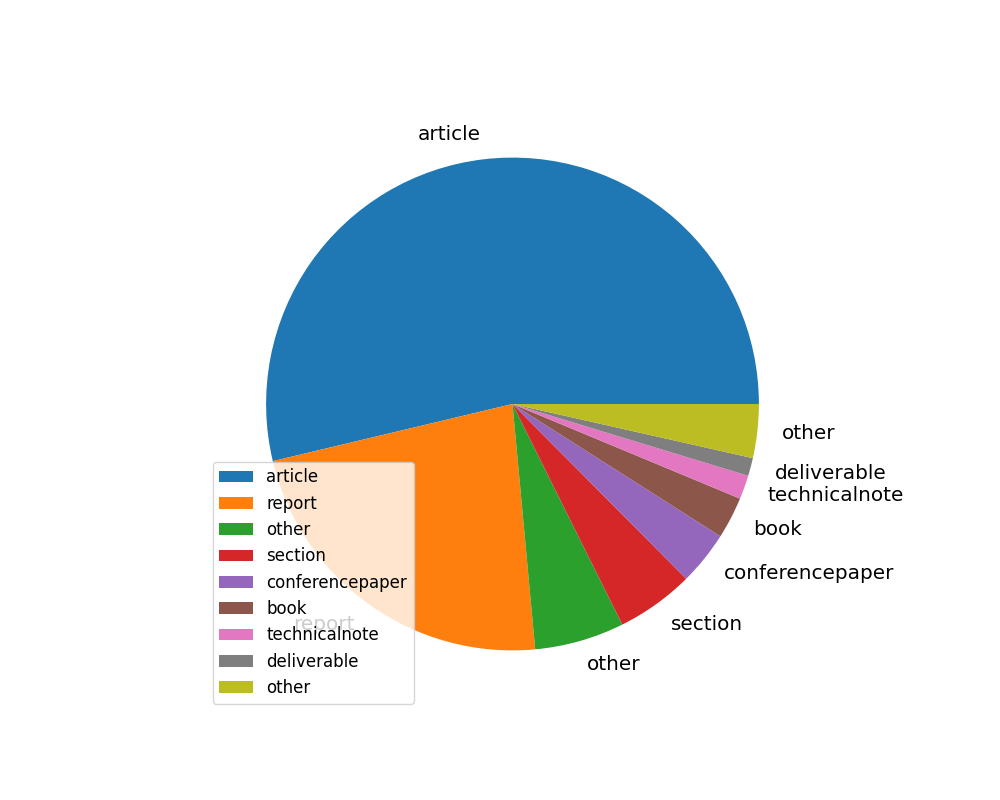
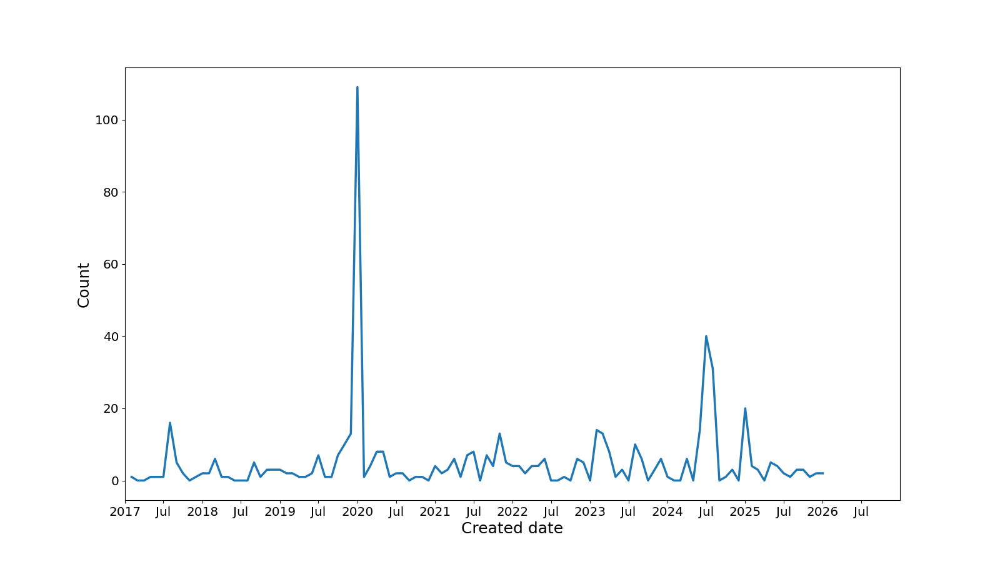
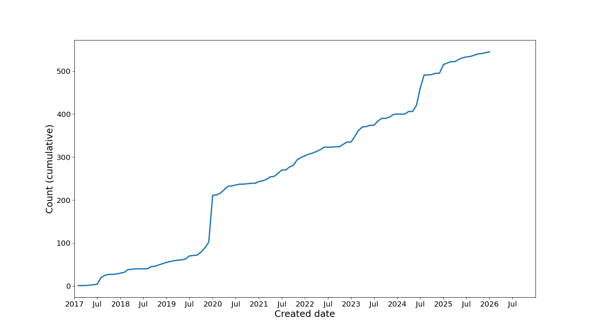
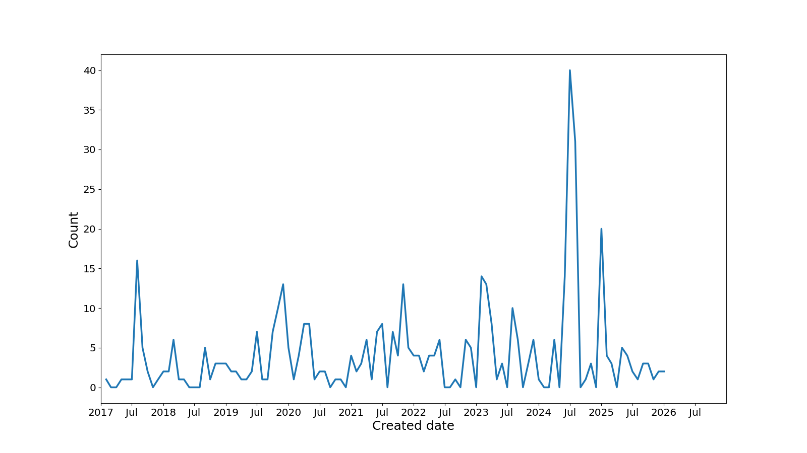
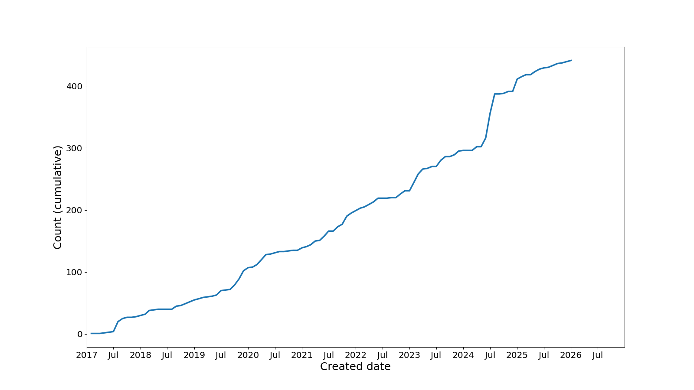

# Zenodo community report

Created: 2026-01-21 17:19:03.261415

Input file: kbnl-2026-01-21-6.json

## Access rights

| accessRight   |   Count |
|:--------------|--------:|
| open          |     543 |
| restricted    |       2 |

[Download data as CSV](./csv/access-rights.csv)

## Licenses

| license      |   Count |
|:-------------|--------:|
| cc-by-4.0    |     528 |
| cc-by-sa-4.0 |       6 |
| other-open   |       4 |
| cc-by-3.0    |       2 |
| unknown      |       2 |
| cc-by-nc-3.0 |       1 |
| cc-by-nc-4.0 |       1 |
| cc-zero      |       1 |

[Download data as CSV](./csv/licenses.csv)

## Keywords

| keyword                                 |   Count |
|:----------------------------------------|--------:|
| digital scholarship                     |     135 |
| Koninklijke Bibliotheek                 |     134 |
| KB, national library of the Netherlands |     133 |
| Olaf Janssen                            |     130 |
| KB Lab                                  |     126 |
| Digital Humanities                      |     126 |
| Entangled Histories                     |     118 |
| Computational linguistics               |     117 |
| other                                   |    2119 |

[Download data as CSV](./csv/keywords.csv)

## Languages

| language   |   Count |
|:-----------|--------:|
| nld        |     323 |
| unknown    |     113 |
| eng        |      76 |
| fra        |      24 |
| hun        |       5 |
| dum        |       2 |
| lat        |       1 |
| fry        |       1 |

[Download data as CSV](./csv/languages.csv)

## Publication types

| type         |   Count |
|:-------------|--------:|
| publication  |     262 |
| dataset      |     115 |
| presentation |     106 |
| poster       |      20 |
| video        |      19 |
| lesson       |      11 |
| other        |       7 |
| software     |       5 |

[Download data as CSV](./csv/pub-types.csv)

## Publication subtypes

| subtype         |   Count |
|:----------------|--------:|
| article         |     137 |
| report          |      58 |
| other           |      15 |
| section         |      13 |
| conferencepaper |       9 |
| book            |       7 |
| technicalnote   |       4 |
| deliverable     |       3 |
| other           |       9 |

[Download data as CSV](./csv/pub-subtypes.csv)

## Created dates

[Download data as CSV](./csv/created.csv)

## Created dates (excluding EH transcriptions)

[Download data as CSV](./csv/created-noeh.csv)

