# Zenodo community report

Created: 2023-01-09 18:41:38.719140

Input file: kbnl-2023-01-09.json

## File types

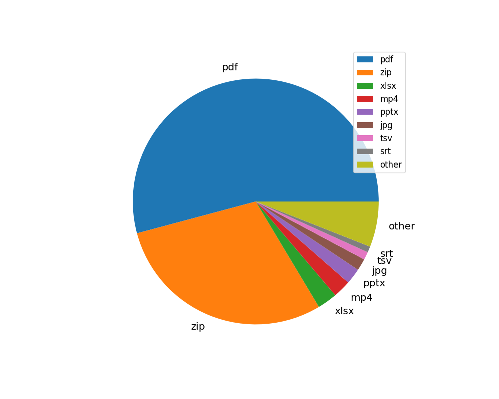

| fileType   |   Count |
|:-----------|--------:|
| pdf        |     208 |
| zip        |     113 |
| xlsx       |      10 |
| mp4        |       9 |
| pptx       |       8 |
| jpg        |       6 |
| tsv        |       4 |
| srt        |       3 |
| other      |      23 |

[Download data as CSV](./csv/file-types.csv)

## Access rights

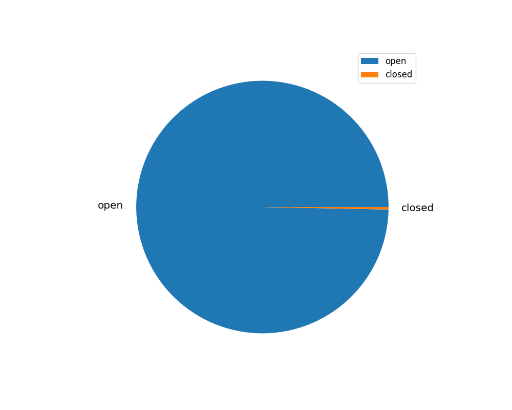

| accessRight   |   Count |
|:--------------|--------:|
| open          |     327 |
| closed        |       1 |

[Download data as CSV](./csv/access-rights.csv)

## Licenses

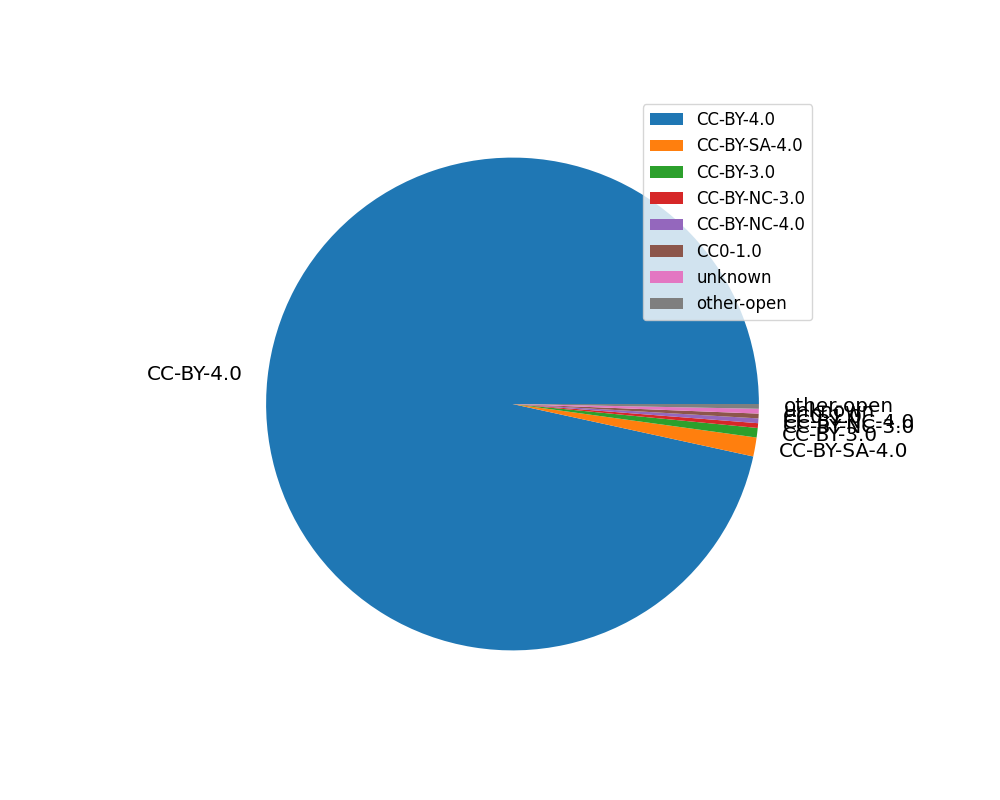

| license      |   Count |
|:-------------|--------:|
| CC-BY-4.0    |     317 |
| CC-BY-SA-4.0 |       4 |
| CC-BY-3.0    |       2 |
| CC-BY-NC-3.0 |       1 |
| CC-BY-NC-4.0 |       1 |
| CC0-1.0      |       1 |
| unknown      |       1 |
| other-open   |       1 |

[Download data as CSV](./csv/licenses.csv)

## Keywords

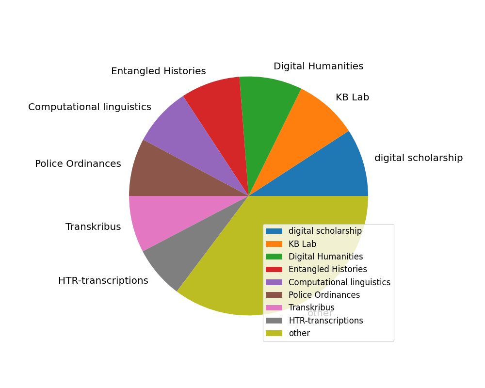

| keyword                   |   Count |
|:--------------------------|--------:|
| digital scholarship       |     135 |
| KB Lab                    |     126 |
| Digital Humanities        |     125 |
| Entangled Histories       |     118 |
| Computational linguistics |     117 |
| Police Ordinances         |     115 |
| Transkribus               |     113 |
| HTR-transcriptions        |     104 |
| other                     |     548 |

[Download data as CSV](./csv/keywords.csv)

## Languages

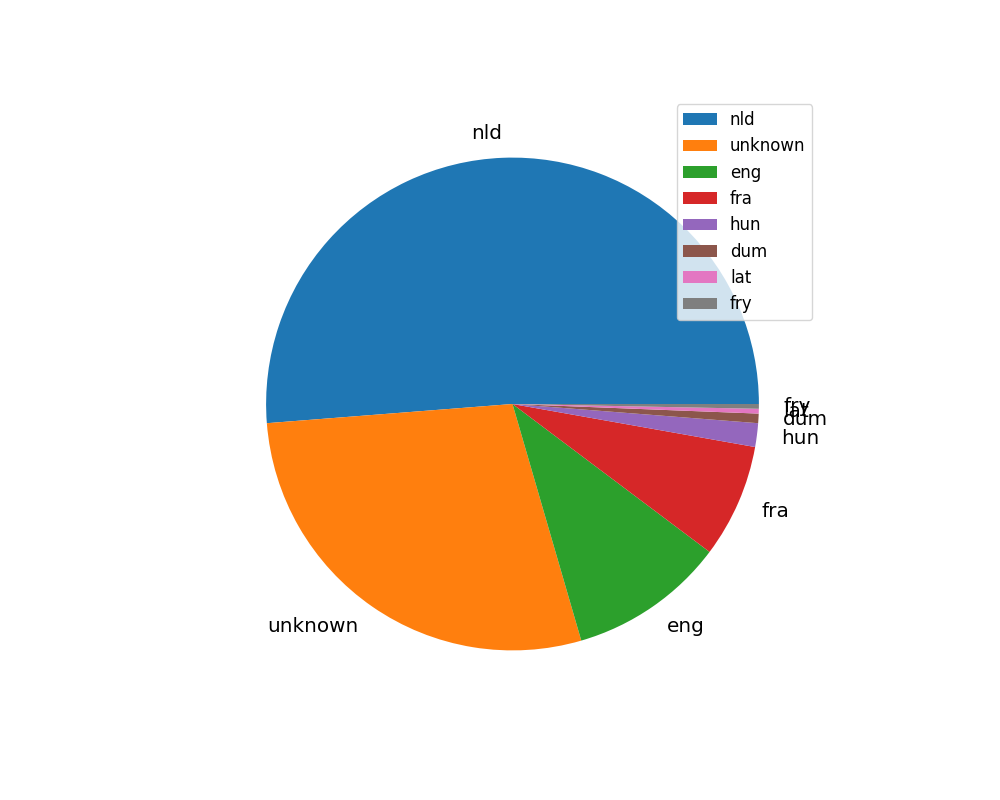

| language   |   Count |
|:-----------|--------:|
| nld        |     165 |
| unknown    |      94 |
| eng        |      36 |
| fra        |      24 |
| hun        |       5 |
| dum        |       2 |
| lat        |       1 |
| fry        |       1 |

[Download data as CSV](./csv/languages.csv)

## Publication types

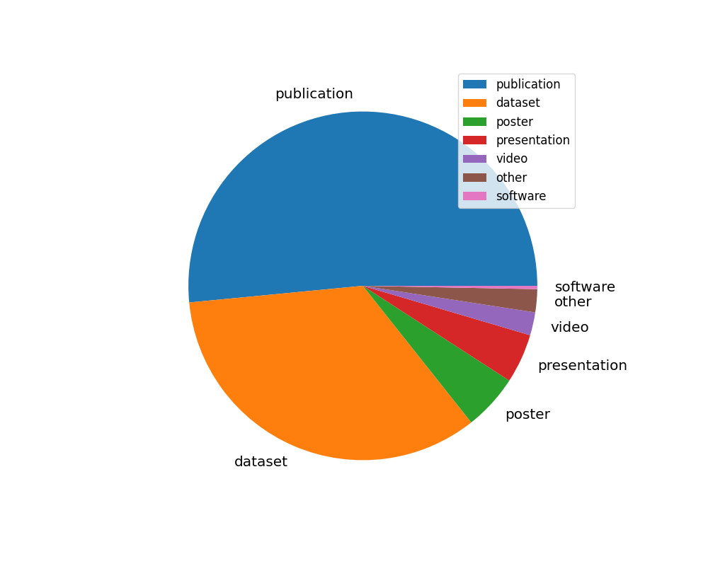

| type         |   Count |
|:-------------|--------:|
| publication  |     169 |
| dataset      |     112 |
| poster       |      17 |
| presentation |      15 |
| video        |       7 |
| other        |       7 |
| software     |       1 |

[Download data as CSV](./csv/pub-types.csv)

## Publication subtypes

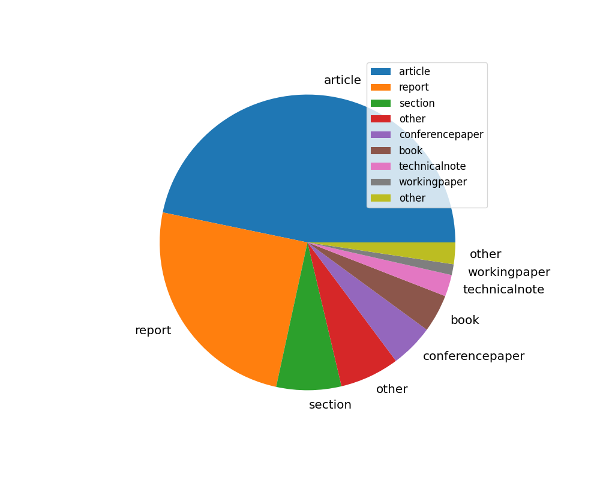

| subtype         |   Count |
|:----------------|--------:|
| article         |      79 |
| report          |      42 |
| section         |      12 |
| other           |      11 |
| conferencepaper |       8 |
| book            |       7 |
| technicalnote   |       4 |
| workingpaper    |       2 |
| other           |       4 |

[Download data as CSV](./csv/pub-subtypes.csv)

## Created dates

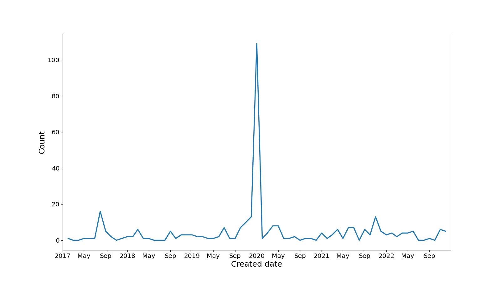

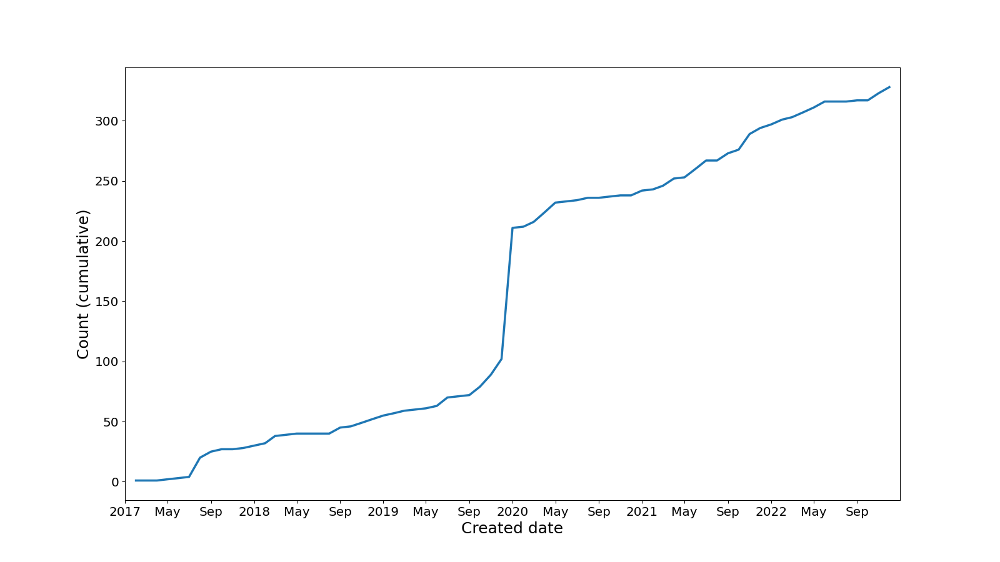

[Download data as CSV](./csv/created.csv)

## Created dates (excluding EH transcriptions)

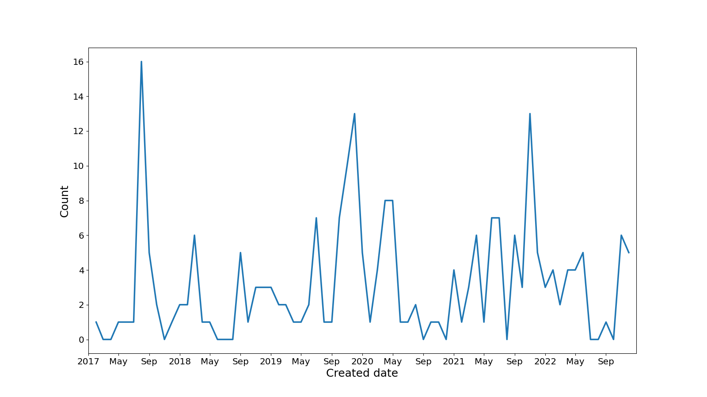

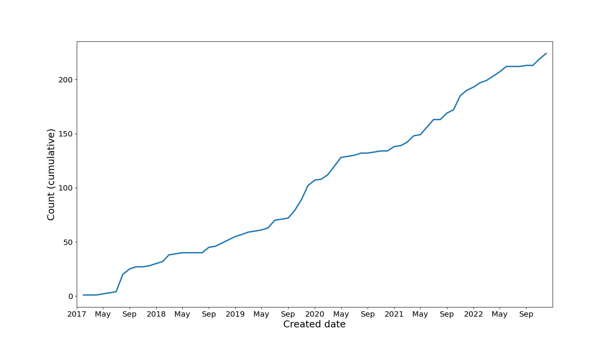

[Download data as CSV](./csv/created-noeh.csv)

