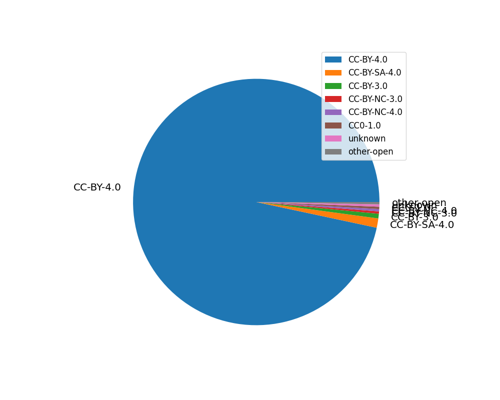
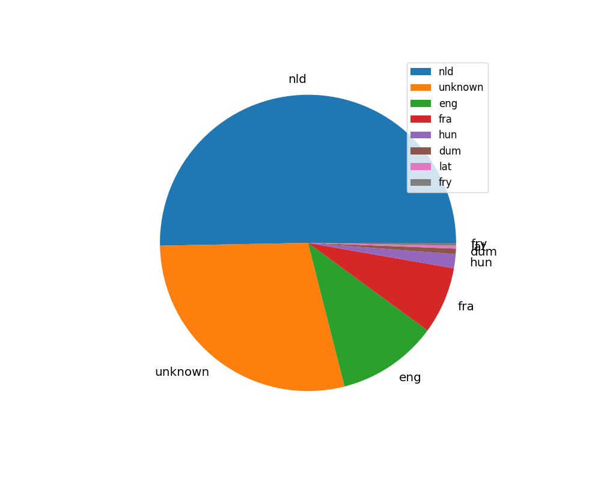

# Zenodo community report

Created: 2022-11-30 19:41:01.468911

## File types

| File type   |   Count |
|:------------|--------:|
| pdf         |     202 |
| zip         |     113 |
| mp4         |       8 |
| pptx        |       8 |
| jpg         |       6 |
| xlsx        |       6 |
| tsv         |       4 |
| srt         |       3 |
| other       |      20 |

[Download data as CSV](./csv/file-types.csv)

## Access rights

| Access type   |   Count |
|:--------------|--------:|
| open          |     321 |
| closed        |       1 |

[Download data as CSV](./csv/access-rights.csv)

## Publication licenses

| Publication license   |   Count |
|:----------------------|--------:|
| CC-BY-4.0             |     311 |
| CC-BY-SA-4.0          |       4 |
| CC-BY-3.0             |       2 |
| CC-BY-NC-3.0          |       1 |
| CC-BY-NC-4.0          |       1 |
| CC0-1.0               |       1 |
| unknown               |       1 |
| other-open            |       1 |

[Download data as CSV](./csv/licenses.csv)

## Keywords

| Keyword                   |   Count |
|:--------------------------|--------:|
| digital scholarship       |     135 |
| KB Lab                    |     126 |
| Digital Humanities        |     125 |
| Entangled Histories       |     118 |
| Computational linguistics |     117 |
| Police Ordinances         |     115 |
| Transkribus               |     113 |
| HTR-transcriptions        |     104 |
| other                     |     519 |

[Download data as CSV](./csv/keywords.csv)

## Publication languages

| Publication language   |   Count |
|:-----------------------|--------:|
| nld                    |     165 |
| unknown                |      91 |
| eng                    |      33 |
| fra                    |      24 |
| hun                    |       5 |
| dum                    |       2 |
| lat                    |       1 |
| fry                    |       1 |

[Download data as CSV](./csv/languages.csv)

## Publication types

| Publication type   |   Count |
|:-------------------|--------:|
| publication        |     164 |
| dataset            |     112 |
| poster             |      17 |
| presentation       |      15 |
| other              |       7 |
| video              |       6 |
| software           |       1 |

[Download data as CSV](./csv/publication-types.csv)

## Publication subtypes

| Publication subtype   |   Count |
|:----------------------|--------:|
| article               |      78 |
| report                |      42 |
| section               |      12 |
| other                 |      11 |
| conferencepaper       |       8 |
| book                  |       7 |
| workingpaper          |       2 |
| deliverable           |       2 |
| proposal              |       1 |
| preprint              |       1 |

[Download data as CSV](./csv/publication-subtypes.csv)

## Created dates

## Created dates (cumulative)

[Download data as CSV](./csv/created-dates.csv)

